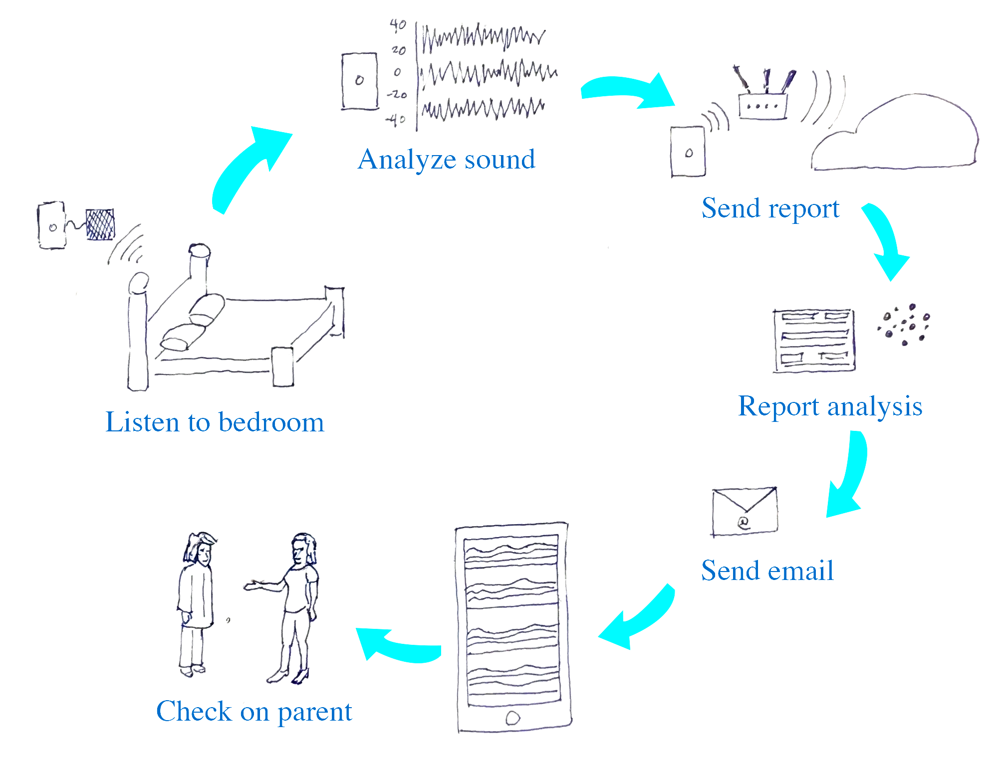
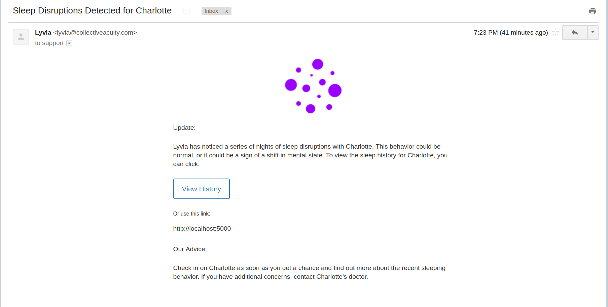
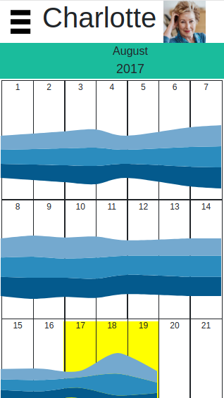

# Lyvia
_A Platform to Spot Sleep Disruptions in People Suffering from Alzheimers_  
**by Jeffrey H, Plamedi M and Richard J**

## Introduction
Lyvia is a platform installed in the bedroom of a parent or loved one diagnosed with Alzheimers. Lyvia listens to bedroom noise for anomalous behavior over a series of nights which might indicate a change in mental state. Significant changes trigger an alert to the caregiver and encourage them to check up on their loved one.  

## Project Materials
[Slide Deck](https://docs.google.com/presentation/d/1aZBg41oWQgx1GNhNuHsYLO1N7pYnZQ7GqTZiuwOe-wU/edit?usp=sharing)  
[GitHub Repo](https://github.com/rj919/lyvia)   

## Benefits
- Private (data collected is analyzed on device)
- Innocuous (set it and forget it)
- Personalized (data model trained on individual)

## Components
- Python
- Javascript
- Flask
- D3
- Heroku
- TensorFlow
- Keras
- SciKit-Learn
- Rasbian
- Raspberry Pi
- PyAudio

## Screenshots
__Architecture:__  

__Email:__  
  

__Analysis:__  

